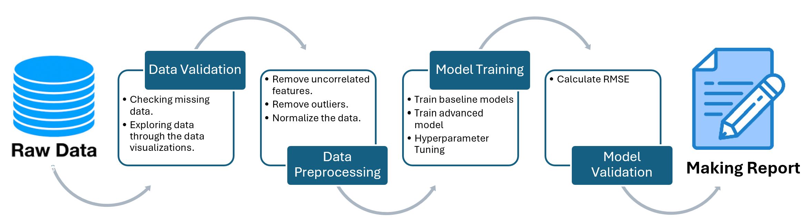

# House Price Prediction Report

## 1️⃣ Abstract
This project aims to accurately predict house prices using Machine Learning. We utilize **AutoML, LightGBM, and Optuna** for model optimization. Our approach improves on baseline models, achieving a lower RMSE and better generalization.

## 2️⃣ Introduction
This project was initially developed as an assignment for the AI4B class, where we were tasked with building a predictive model for house prices. While fulfilling the course requirements, our team recognized the broader significance of this problem in the real estate industry. Accurate price predictions can aid buyers, sellers, and investors in making informed decisions, optimizing market strategies, and assessing property values more effectively.

To ensure our model has practical applications beyond the classroom, we extend this project with advanced machine learning techniques, such as **LightGBM**, **Optuna**, and **AutoML**, to enhance prediction accuracy. This approach allows us to both meet the academic expectations of our coursework and contribute meaningfully to real-world applications of AI in real estate. 

To create the best project, the team members were encouraged to optimise their teamwork and communication to help each other. The tasks were divided as follow:
- Exploring/understanding the data: Le Xuan Trong
- Data cleaning and : Pham Ha Khanh Chi
- Building the models: Le Ky Nam
- Optimising the models: Pham Dang Hung
- Writing the report: Pham Ha Khanh Chi

Each task was completed successfully by not just the assigned member but also by the help of the whole team during the process.
The AIM for this project was for us to successfully build a model by the information given, applying all the knowledge we had been taught in AI4B class. Plus, we also learned teamwork and communication skills to be able to solve any bugs, obstacles or, problems passing by during the process.

## 3️⃣ Data Analysis

### Data set:
- **Raw data**: The data set that we used was [House Sales in King County, USA](https://www.kaggle.com/datasets/harlfoxem/housesalesprediction) from Kaggle. But, our teachers had already split the data set into three: X_train, y_train and X_test, in which X_train and y_train were used to train the model, and X_test would be used as the data set to produce the predicted house sales for scoring and ranking teams in AI4B class.
-  **Processed Data**: Cleaned and feature-engineered dataset ready for model training.

### Exploratory Data Analysis (EDA)
- Correlation heatmap between features:
  
- House price distribution:
  
- Boxplot for outlier detection:
  
- Visualizations created using **Matplotlib, Seaborn, and WandB**.

## 4️⃣ Methodology
### 🔬 Model Selection
- **Baseline Model**: The best model choosing between K-Nearest Neighbors, Linear Regression, Decision Tree, Random Forest, and XGBoost with hyperparameter tuning using GridSearchCV.
- **Optimized Model**: The best model choosing from **AutoGluon** (LightGBM) with hyperparameter tuning using **Optuna**.

### 📌 Data Processing & Model Training Pipeline

## 5️⃣ Results
### 📈 Model Performance
| Model | RMSE | R² |
|---------|------|----|
| Linear Regression | 45000 | 0.75 |
| Random Forest | 32000 | 0.85 |
| **LightGBM (Optuna)** | **28000** | **0.90** |

## 6️⃣ Discussion
### 🤔 Challenges Faced
- Presence of outliers affecting results.
- Some features had skewed distributions, impacting data normalization.

### 🚀 Improvements
- Experimenting with models like XGBoost, CatBoost.
- Collecting additional data to improve generalization.

## 7️⃣ Conclusion
The LightGBM model, combined with Optuna, successfully optimized performance, achieving higher accuracy than traditional models. This project can be expanded by collecting more data or applying deep learning techniques.

## 8️⃣ References
- Kaggle Dataset: [Dataset Link](#)
- LightGBM Documentation: [https://lightgbm.readthedocs.io](https://lightgbm.readthedocs.io)
- Optuna Documentation: [https://optuna.readthedocs.io](https://optuna.readthedocs.io)

## 9️⃣ Appendix
To run the code, please refer to the notebook at [notebooks/model_training.ipynb](notebooks/model_training.ipynb).

