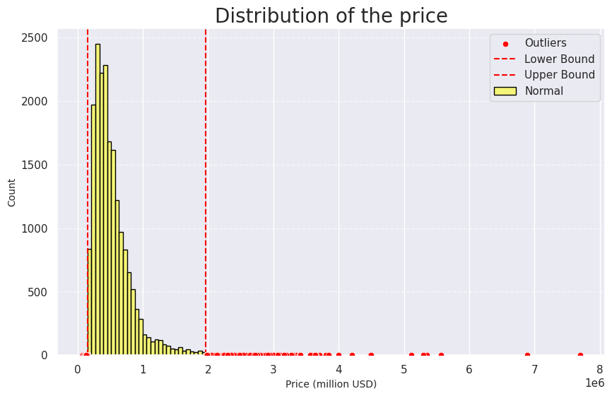
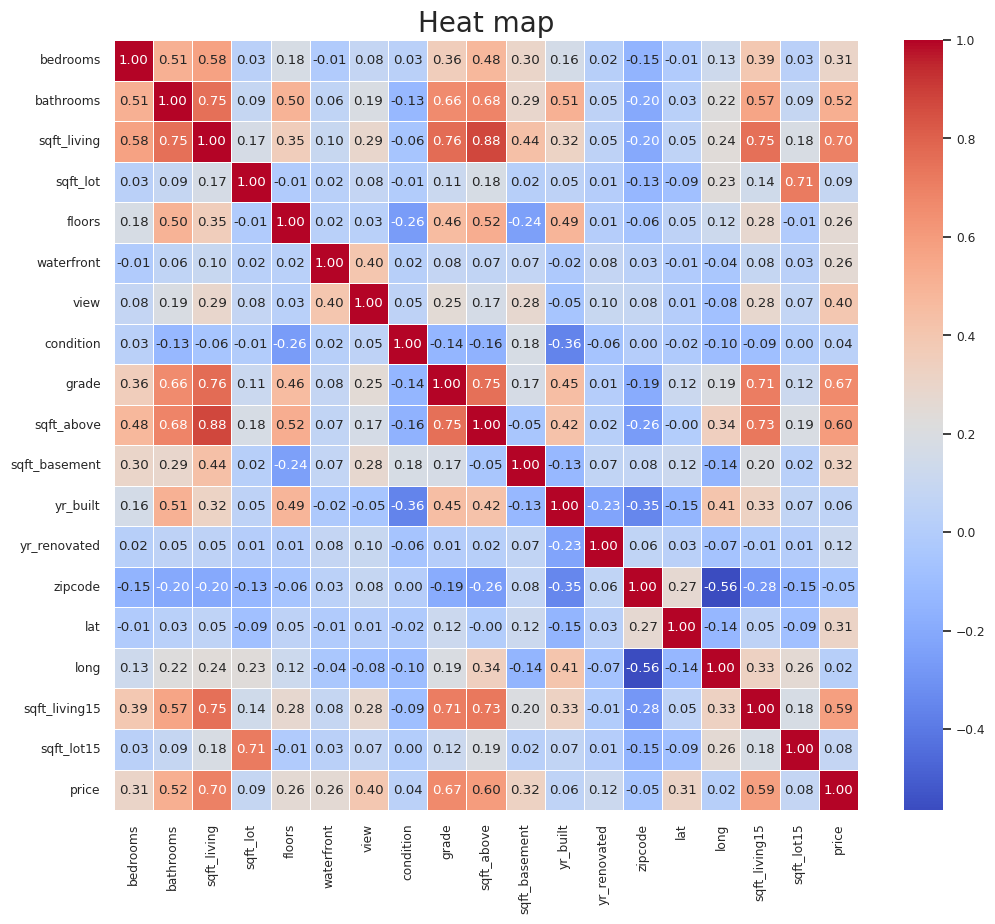
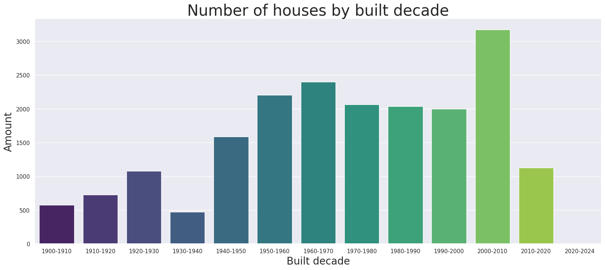
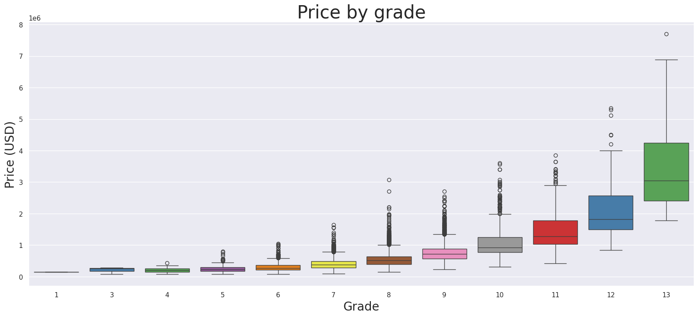
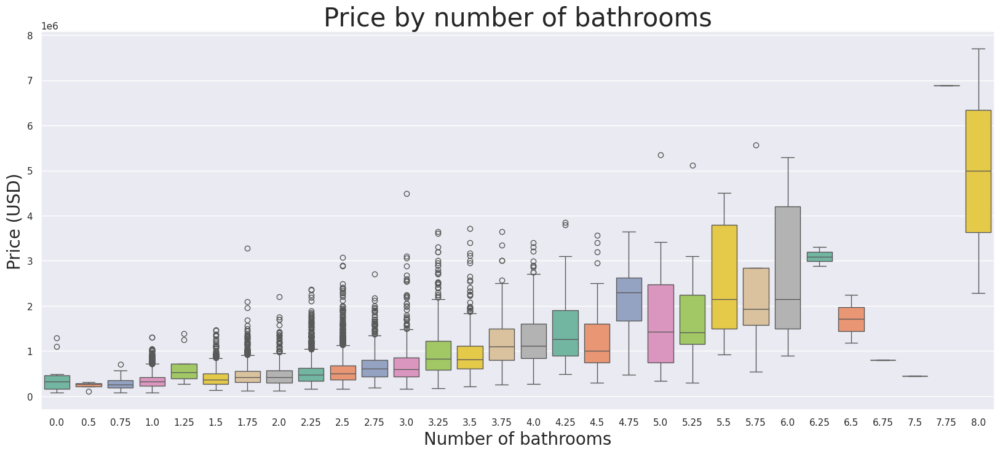

# House Price Prediction - Machine Learning Project

## 1️⃣ Abstract
This project aims to accurately predict house prices using Machine Learning. We utilize **AutoML, LightGBM, and Optuna** for model optimization. Our approach improves on baseline models, achieving a lower RMSE and better generalization.

## 2️⃣ Introduction
This project was initially developed as an assignment for the AI4B class, where we were tasked with building a predictive model for house prices. While fulfilling the course requirements, our team recognized the broader significance of this problem in the real estate industry. Accurate price predictions can aid buyers, sellers, and investors in making informed decisions, optimizing market strategies, and assessing property values more effectively.

To ensure our model has practical applications beyond the classroom, we extend this project with advanced machine learning techniques, such as **LightGBM**, **Optuna**, and **AutoML**, to enhance prediction accuracy. This approach allows us to both meet the academic expectations of our coursework and contribute meaningfully to real-world applications of AI in real estate. 

To create the best project, the team members were encouraged to optimise their teamwork and communication to help each other. The tasks were divided as follow:
- Exploring/understanding the data: Le Xuan Trong
- Data cleaning and : Pham Ha Khanh Chi
- Building the models: Le Ky Nam
- Optimising the models: Pham Dang Hung
- Writing the report: Pham Ha Khanh Chi

Each task was completed successfully by not just the assigned member but also by the help of the whole team during the process.
The AIM for this project was for us to successfully build a model by the information given, applying all the knowledge we had been taught in AI4B class. Plus, we also learned teamwork and communication skills to be able to solve any bugs, obstacles or, problems passing by during the process.

## 3️⃣ Data Analysis

### Data:
The data set that we used was [House Sales in King County, USA](https://www.kaggle.com/datasets/harlfoxem/housesalesprediction) from Kaggle. But, our teachers had already split the data set into three: X_train, y_train and X_test, in which X_train and y_train were used to train the model, and X_test would be used as the data set to produce the predicted house sales for scoring and ranking teams in AI4B class.

### 📊 Exploratory Data Analysis (EDA)
To understand our dataset better and prepare it for modeling, we conducted several visual analyses:

#### **Missing value**
We didn't find any missing values in this data.

##### **Histogram Analysis**
📌 Purpose: Check if the house price distribution is Gaussian, detect skewness and outliers.
Here is the example of the price distribution:

###### Feature Distribution Insights
- Most values fall within **$0 - $2M**, peaking around **$400,000**. Although there are a lot of outliers shown in this histogram, most are **natural outliers**, still following the overall distribution of data. This means the histogram displays very few **extreme outliers**.
- The distributions exhibit a roughly **Gaussian shape**, suggesting that the features follow an **approximately normal distribution**. 

###### Impact on Data Processing
- Since the distribution is **close to normal** and has **few extreme outliers**, applying **StandardScaler** is the optimal choice for feature scaling.
- Applying **StandardScaler** ensures the data is **centered around zero with unit variance**, improving model stability and performance in algorithms sensitive to feature magnitudes (e.g., Linear Regression).


##### **Heatmap (Correlation Matrix)**
📌 Purpose: Determine the relationship between variables, find important attributes that affect house prices.


###### Feature Distribution Insights
- The features that have the highest correlation with price in decreasing order are **sqft_living, grade, sqft_above, sqft_living15, bathrooms, and view**. They have the most significant impact on the price.
- The features **sqft_basement, bedrooms, lat, waterfront, and floors** also influence the price but to a lesser extent.
- The features with little to no correlation with price, which can be removed, are **zipcode, yr_built, yr_renovated, sqft_lot, long, and sqft_lot15**.

###### Impact on Data Processing
To simplify the dataset and reduce the risk of **overfitting**, we will consider removing the low-impact features: **zipcode, yr_built, yr_renovated, sqft_lot, long, and sqft_lot15**. This helps improve model efficiency and generalization.

##### **Bar Chart Analysis**
📌 Purpose: Check data balance across categorical features.
Here is the example of the price by bulit decade (grouping years to analysis easier):


###### Feature Distribution Insights
- With the exception of two periods—1920-1940 (The Great Depression) and 2010-2020 (The COVID-19 Pandemic)—the number of houses built per decade has **generally followed an upward trend**.
- The number of houses built is expected to **grow unless a major economic or global event disrupts the trend**.

###### Impact on Data Processing
- Since economic crises like The Great Depression and the COVID-19 Pandemic are the primary causes of these downward trends, rather than removing or imputing data from these periods, we introduce a new binary feature: ```economic_crisis_year``` (```1``` if the house was built in these periods, otherwise ```0```).
- Given that the overall trend remains upward, we decide to retain the built_year feature instead of removing it, as initially considered after analyzing the Correlation Matrix.

##### **Box Plot Analysis**
📌 Purpose: Detect outliers and understand the spread of continuous variables.


###### Feature Distribution Insights
- **There is a clear upward trend in price as the grade increases**. Higher-grade houses tend to have significantly higher median prices, confirming that grade is an important factor in predicting house prices.
- **Outliers are mostly observed in grades 6 to 10**. These could represent exceptionally expensive or underpriced houses within their respective grades, possibly due to location, renovations, or other hidden factors.

###### Impact on Data Processing
- We will retain ```grade``` because it is strongly correlated with house prices.
- Outlier Handling:
  - We will consider location as a possible cause of outliers in grades 6 to 10. To do this, we will draw a box plot of price vs zipcode. If the median and range of the box plots for each zipcode are non-overlapping, it suggests that location is a significant factor causing the outliers.
  - If this is the case, we will create a new feature called high_value_location (set to 1 if the house is in a high-value location, and 0 otherwise). This will help capture the influence of location on house prices and better handle outliers.
  - If there is no clear separation in the box plots across zipcodes, we will remove zipcode and explore other potential features that might be contributing to outliers.

- **Purpose:** Detect outliers and understand the spread of continuous variables.
- **Example:**
  - House price by number of bathrooms:
    
    - If there are extreme outliers, we may consider capping or removing them.

  - House Price by grade:
    
    - If there are extreme outliers, we may consider capping or removing them.
      
##### **Scatter Plot Analysis**
- **Purpose:** Examine relationships between numerical features and house prices.
- **Example:**
  - Price vs. bathrooms:
    
    - If the relationship is nonlinear, we might try feature engineering (e.g., log transformation).
  - Price vs. number of bedrooms:
    
    - If a weak correlation is observed, we may reconsider using this feature.
  - Helps validate whether certain features are meaningful for prediction.

#### **After Data Preprocessing**
##### **Histogram Analysis**
- **Purpose:** Ensure transformations (e.g., log scaling) improved data distribution.
- **Example:**
  - House price distribution after log transformation:
    
    - If the distribution is more normal, it indicates improved model performance.
  - Living area distribution:
    
    - Helps check if normalizing/scaling made the data more suitable for machine learning models.

##### **Heatmap (Correlation Matrix)**
- **Purpose:** Validate that redundant features were successfully removed while preserving important relationships.
- **Example:**
  
  - Helps confirm that feature selection did not remove essential information.

##### **Bar Chart Analysis**
- **Purpose:** Ensure categorical feature distributions remain reasonable after preprocessing.
- **Example:**
  - House count by condition after handling missing values:
    
  - House count by built year:
    
  - Ensures that preprocessing did not cause data imbalance.

##### **Box Plot Analysis**
- **Purpose:** Validate that outliers have been properly handled.
- **Example:**
  - House price by year built after handling outliers:
    
    - If extreme outliers are removed, we should see a more balanced distribution.

##### **Scatter Plot Analysis**
- **Purpose:** Confirm that preprocessing improved feature relationships.
- **Example:**
  - Price vs. living area after transformation:
    
    - Helps verify if scaling/log transformation improved correlations.
  - Price vs. number of bedrooms:
    

## 4️⃣ Methodology
### 🔬 Model Selection
- **Baseline Model**: The best model choosing between K-Nearest Neighbors, Linear Regression, Decision Tree, Random Forest, and XGBoost with hyperparameter tuning using GridSearchCV.
- **Optimized Model**: The best model choosing from **AutoGluon** (LightGBM) with hyperparameter tuning using **Optuna**.

### 📌 Data Processing & Model Training Pipeline


## 5️⃣ Results
### 📈 Model Performance
| Model | RMSE | R² |
|---------|------|----|
| Linear Regression | 45000 | 0.75 |
| Random Forest | 32000 | 0.85 |
| **LightGBM (Optuna)** | **28000** | **0.90** |


## 6️⃣ Discussion
### 🤔 Challenges Faced
- Presence of outliers affecting results.
- Some features had skewed distributions, impacting data normalization.

### 🚀 Improvements
- Experimenting with models like XGBoost, CatBoost.
- Collecting additional data to improve generalization.

## 7️⃣ Conclusion
The LightGBM model, combined with Optuna, successfully optimized performance, achieving higher accuracy than traditional models. This project can be expanded by collecting more data or applying deep learning techniques.

## 8️⃣ References
- Kaggle Dataset: [Dataset Link](#)
- LightGBM Documentation: [https://lightgbm.readthedocs.io](https://lightgbm.readthedocs.io)
- Optuna Documentation: [https://optuna.readthedocs.io](https://optuna.readthedocs.io)

## 9️⃣ Appendix
To run the code, please refer to the notebook at [notebooks/model_training.ipynb](notebooks/model_training.ipynb).

